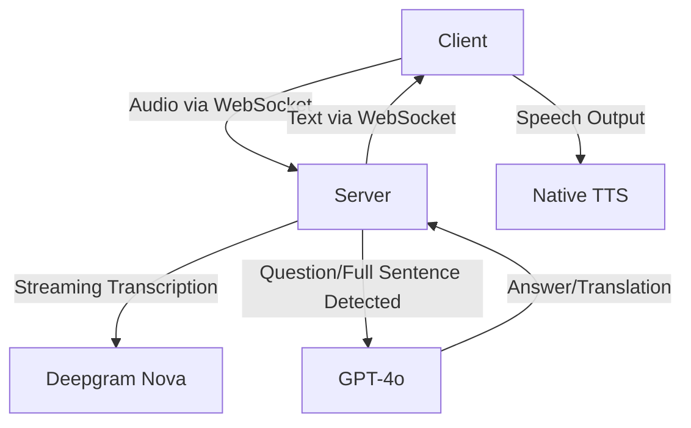

# Klugscheisser

## Be the Smartest Person in the Room

<!-- Presenter notes:
Start with a sarcastic joke: "Welcome everyone—today we learn how to cheat at conversations using AI. I'm Aleksandr, your humble host, and definitely the smartest person here (thanks to Klugscheisser)."
-->

---
layout: image-right
image: assets/photo_2025-03-27_15-26-34.jpg
---

# Aleksandr Movchan

- AI Developer & Enthusiast
- Proud creator of Klugscheisser
- Expert at pretending to be smart

<!-- Presenter notes:
Briefly introduce yourself, your role, and why you’re clearly qualified to talk about this—"because I built the thing, obviously."
-->

---
layout: image-right
image: assets/ChatGPT Image Mar 27, 2025, 04_01_09 PM.png
backgroundSize: contain
---

# What is Klugscheisser?

Klugscheisser is an AI tool designed to make **you** the smartest person in any room—no matter how clueless you actually are.

**Why?**
- ChatGPT and Copilot makes you sound smart behind a screen, but what about in real life?
- Klugscheisser is the answer!

**Two amazing modes:**

- **Q&A Mode:** Answers every question you (pretend to) understand.
- **Translator Mode:** Breaks language barriers, allowing you to misunderstand people internationally.

<!-- Presenter notes:
Joke about how Klugscheisser helps even the most socially awkward among us sound intelligent.
-->

---
layout: image-right
image: assets/Screenshot 2025-03-27 at 15-53-42 Klugscheiser.png
backgroundSize: contain
---

# Q&A Mode

- Klugscheisser listens continuously, transcribing your conversations.
- Detects when someone asks a question.
- Generates a suspiciously intelligent answer using GPT-4o.
- Answers are spoken out loud, making you appear as smart as Wikipedia.

<!-- Presenter notes:
Explain that Klugscheisser is essentially your "phone-a-friend" but without needing friends.
-->

---
layout: image-right
image: assets/Screenshot 2025-03-27 at 15-54-22 Klugscheiser.png
backgroundSize: contain
---

# Translator Mode

- Listens continuously in a specific language.
- Detects full sentences and translates instantly.
- Ensures you misunderstand your international colleagues in real-time, but at least fluently.

<!-- Presenter notes:
Mention humorous translation fails as a relatable example. "It's like Google Translate, but actually useful."
-->

---
layout: two-cols
---

# Server-Client Magic

- **Client:**

  - Web-app or Python script
  - Streams audio chunks to server via WebSocket

- **Server:**
  - Transcribes with Deepgram Nova
  - Generates answers/translations via GPT-4o
  - Sends responses back instantly via WebSocket

::right::

<!-- Presenter notes:
Sarcastically comment: "Here's a diagram to pretend like you care about technical details. It’s mostly arrows pointing at fancy boxes."
Joke: "For those who don't get tech-speak: Client asks questions, server does the thinking—just like at a restaurant."
-->

---

# Live Demonstration

Does it actually work? I guess we'll find out together!

<!-- Presenter notes:
"I was told demonstrations make presentations more professional, so here’s proof it exists. Trust me, it’s awesome."
-->

---
layout: image-right
image: assets/klugscheisser_qr_code.png
backgroundSize: contain
---

# Final Thoughts

- GitHub repo because sharing is caring!
https://github.com/movchan74/klugscheiser
- Recommended tools:
  - Tailscale for secure remote access
  - Deepgram for real-time transcription ($200 credit for free!)
  - Slidev for making awesome presentations in Markdown
  - Oracle Cloud Free Tier for free compute resources (4 CPUs, 24GB RAM for free!)
- Find me if you want to chat about AI, Klugscheisser, smart glasses, or anything else!

---

# Questions? (I'll secretly ask Klugscheisser for answers)

<!-- Presenter notes:
End with humor: "If you have difficult questions, ask Klugscheisser—because I certainly won't know."
-->
